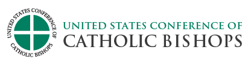

# Catholic Resources

## Daily preparations

<table>
<tr><td width=450px></td><td><a href='http://onlineministries.creighton.edu/CollaborativeMinistry/daily.html'>Reflection Site</a></td></tr>

<tr><td></td><td><a href='http://www.usccb.org/bible/reflections/'>Daily Reflections</a></td></tr>
</table>

## News Sites
<table>
<tr><td width=450px></td><td><a href='https://www.lifesitenews.com/all/today'>Life Site</a></td></tr>

<tr><td bgcolor='blue'></td><td><a href='https://www.catholicculture.org/news/'>Catholic Culture</a></td></tr>
<tr><td></td><td><a href='https://catholicherald.co.uk/section/news/'>Catholic Herald</a></td></tr>
<tr><td></td><td><a href='https://www.ewtn.com/tv/live/ewtnnewsnightly.asp'>EWTN Nightly</a></td></tr>
<tr><td></td><td><a href='http://www.ncregister.com/'>Natholic Catholic</a></td></tr>
<tr><td bgcolor='black'></td><td><a href='https://www.churchmilitant.com/search/latest'>Latest</a></td></tr>
<tr><td></td><td><a href='http://thewandererpress.com/'>The Wanderer</a></td></tr>
</table>

## Challenging Sites
<table>
<tr><td width=450px bgcolor='black'></td><td><a href='https://www.churchmilitant.com/video/archive/the-vortex'>The Vortex</a></td></tr>
<tr><td bgcolor=' #242c34'></td><td><a href='http://ronrolheiser.com/archive/'>Ron Rolheiser</a></td></tr>
</table>
